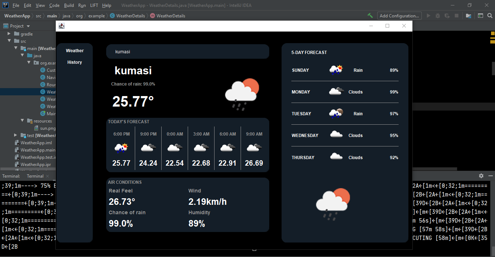

# WEATHER GUI IN JAVA
This is a graphical user interface built in java using the Swing library. Several layout managers including GridBagLayout, GridLayout and BorderLayout were employed in the implementation to achieve a beautiful design comparable to modern interfaces. Below is a preview of the GUI applicatio!n

